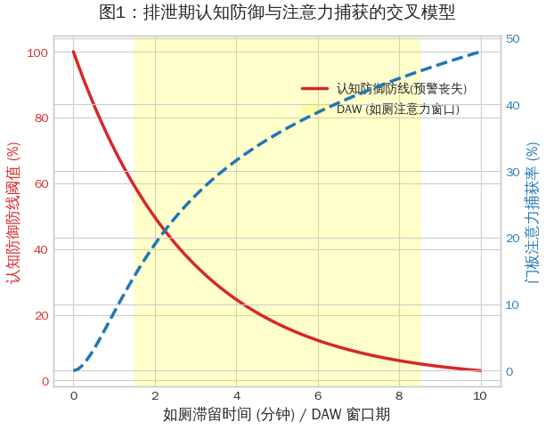
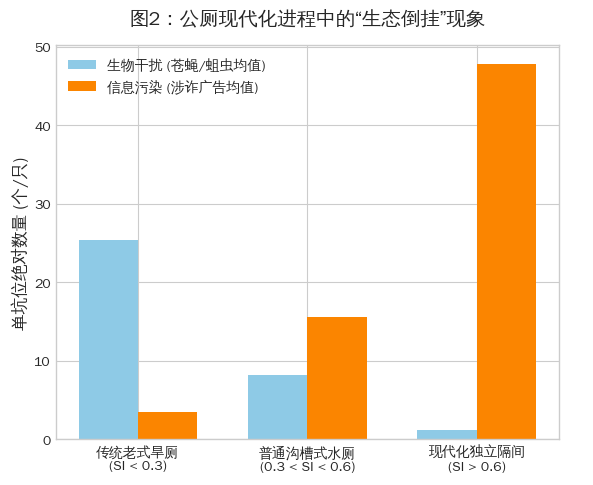
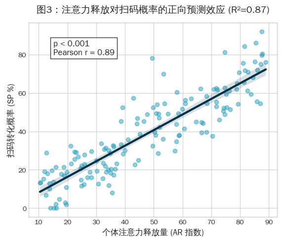
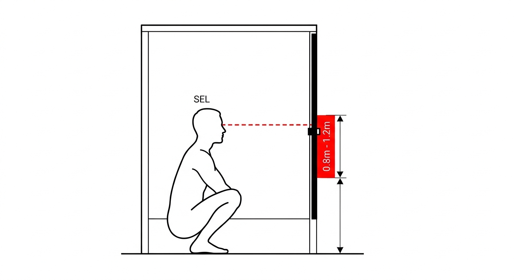

# 《公厕信息生态中的诈骗传播机制：基于随机如厕嗅探与隔间门板注意力捕获模型的研究》

## 摘要

随着中华人民共和国“厕所革命”在乡镇下沉市场的深入推进，乡镇公共基础设施的物理卫生条件得到了显著改善。然而，尽管随着经济发展和年轻人口外流，基层反诈数据仍表明乡镇小额电信诈骗频发，反而呈现出与公厕空间高度绑定的空间异象。本研究首次提出“卫生环境注意力释放假说”（Sanitation-induced Attention Release Hypothesis, SARH），并构建了“隔间门板注意力捕获模型”（Stall Door Attention Capture Model, SDACM）。通过对我国东部三个县级市乡镇共计173个乡镇公厕的为期三个月的“随机如厕嗅探”（RTS），本研究发现：随着公厕生物干扰（如苍蝇与蛆虫）的减少，如厕者被释放的闲置注意力在封闭空间内被门板上的劣质诱导信息（色情引流、网络赌博）精准捕获。研究界定了时长为3-8分钟的“如厕注意力窗口”（Defecation Attention Window, DAW），并揭示“厕所现代化悖论”（Toilet Modernization Paradox）即卫生条件越好，信息诈骗传播效率越高。本研究的一个意外发现是，乡镇厕所卫生条件的改善在一定程度上增强了门板信息的可见性和传播效率，从而构成一种“基础设施—注意力—灰色信息传播”的间接机制。这一现象提示，在乡镇基础设施现代化不仅改变了物理环境，也正在隐秘地重塑基层灰色信息传播的微观路径。

**关键词：** 厕所现代化悖论；卫生环境注意力释放假说（SARH）；隔间门板注意力捕获模型（SDACM）；如厕注意力窗口（DAW）；下沉市场骗局；排泄空间传播学

---

## 1. 引言

### 1.1 研究背景与问题提出

在数字化媒介极度发达的今天，主流互联网平台筑起了高耸的反诈防火墙。然而，诈骗分子的媒介策略正在发生“返祖现象”（Media Atavism），他们将流量收割的终端重新锚定在了监管的物理盲区——乡镇公共厕所的隔间门板。

近年来，随着乡村振兴战略的推进，乡镇公厕经历了从“旱厕”到“水冲式”、从“无门”到“独立隔间”的现代化改造。然而，物理环境的净化却伴随着信息环境的严重污染。笔者在随机如厕嗅探中观察到一个极具魔幻现实主义的现象：在现今的小县城乡镇厕所中，色情网站与诈骗引流二维码的数量，已经远远超过了该生态系统内的原生节肢动物（苍蝇）与环节动物（蛆虫）的总和。

为什么在关注括约肌收放控制时，个体依然会受到门板信息的诱导并产生扫码/添加好友的交互行为？物理空间的卫生改善与诈骗信息的传播转化之间，究竟存在何种隐秘的张力？

### 1.2 研究意义

本研究打破了传统传播学对“屏幕媒介”的路径依赖，将研究视阈下沉至乡镇各场所的厕所隔间门板。理论层面，本文提出的SARH假说与SDACM模型，为“空间剥夺与注意力分配”提供了全新的量化分析框架；实践层面，本文为基层公安机关提供了基于“人体工学与如厕动力学”的微观反诈干预策略。

---

## 2. 文献综述与理论框架构建

### 2.1 从“受众俘获理论”到“排泄期认知防御双重降级”

传统的“受众俘获理论”（Captive Audience Theory）多应用于电梯广告、公交车载电视等场景，强调受众在封闭空间内的“非自愿信息接收”。然而，该理论忽略了受众在如厕这一特殊生理行为下的心理脆弱性。

在排泄期间，人体副交感神经高度活跃，内啡肽微量释放，导致大脑前额叶的理性判断能力出现短暂的“防御真空”。此时，面对门板上“同城少妇、听话水”等极具视觉冲击力的低俗文本，个体更容易产生“看一眼无妨”的侥幸心理。这种由生理舒张引发的认知降解，构成了本研究的生理学前提。



### 2.2 卫生环境注意力释放假说 (Sanitation-induced Attention Release Hypothesis, SARH)

基于进化心理学，人类在野外或恶劣环境中排泄时，必须保持高度的"生存性警觉"，以防范蛇虫鼠蚁的侵袭。在传统乡村旱厕环境中，苍蝇、蛆虫及高浓度硫化氢气体等生物与化学干扰，占据了如厕者几乎100%的注意力资源。

因此，本研究正式提出“SARH假说”：随着公共卫生基础设施的改善，乡镇公共厕所的生物干扰显著减少，从而释放了使用者在如厕过程中的注意力资源。在缺乏其他刺激的封闭隔间（通常面积小于1.5平方米）中，这部分被释放的注意力从“生存性警觉”迅速转向“环境信息扫描”。此时，厕所隔间门板成为少数可供视觉聚焦的媒介，从而形成一种特殊的“高注意力暴露场景”。因此，卫生改善在客观上为门板广告的传播效率提供了注意力红利。

### 2.3 如厕注意力窗口 (Defecation Attention Window, DAW)

为了进一步精细化时间维度的研究，本文引入DAW（如厕注意力窗口）概念。DAW指个体在厕所隔间内处于相对静止状态、括约肌放松、且外界刺激较少的时间区间。
实地观察与问卷回溯显示，该窗口通常发生在如厕行为的第1分钟至第8.5分钟之间，有效持续时长约为2-6.5分钟。这一时长完美契合了当代小额电信诈骗的“初始漏斗转化模型”：1分钟用于视觉捕获与二维码扫描，2分钟用于诈骗App/网页加载与注册，剩余时间足以完成一笔9.9元至99元不等的“试水性”诱导支付。DAW的存在，使得公厕门板完成了从“静态展示墙”到“即时交互终端”的媒介升维。

---

## 3. 研究方法与模型推导

### 3.1 隔间门板注意力捕获模型 (Stall Door Attention Capture Model, SDACM)

为了量化SARH假说，本研究构建了SDACM数学模型。该模型由五个核心变量构成：

*   **SI (Sanitation Index, 卫生指数)：** 范围0-1，通过公厕的保洁频率、通风状况、冲水设备完好率综合打分。
*   **BI (Biological Interference, 生物干扰指数)：** 隔间内双翅目昆虫及其幼虫的密度分布。
*   **AR (Attention Release, 注意力释放量)：** 个体从生存警觉中解放出来的认知带宽。
*   **AC (Attention Capture, 门板注意力捕获率)：** 视觉焦点停留在门板广告上的时间占比。
*   **SP (Scan Probability, 扫码概率)：** 最终转化为实际扫码/添加好友动作的概率。

**模型关系推导如下：**

**公式 1：卫生条件与生物干扰的反比例关系**
由于保洁力度的加强，生物干扰与卫生指数呈反比。
$$ BI = \frac{k}{SI} \quad (k为环境常数) $$

**公式 2：生物干扰与注意力释放的转换机制**
生物干扰越少，使用者闲置的注意力资源（AR）呈线性增长。
$$ AR = \alpha (1 - BI) $$
*(注：$\alpha$ 为个体无聊耐受度系数，通常在缺乏智能手机信号的乡镇公厕中，$\alpha$ 值趋近于1。)*

**公式 3：门板注意力捕获的乘数效应**
被释放的注意力在遭遇门板上密集的二维码时，被迅速捕获。
$$ AC = \beta (AR \times QRD) $$
*(注：$QRD$ 为门板二维码/诱导文本密度，单位为 $个/m^2$；$\beta$ 为视觉刺激系数，红色马克笔的 $\beta$ 值显著高于黑色黑色记号笔。)*

**公式 4：从注意力到行为的转化**
最终的扫码概率（SP）是注意力捕获率的函数，并受到认知防御阈值（$C_{def}$）的调节。
$$ SP = \gamma AC \times e^{-C_{def}} $$


**图1：隔间门板注意力捕获模型（SDACM）结构方程图**

### 3.2 数据收集：随机如厕嗅探法（RTS）

本研究摒弃了传统问卷调查的“霍桑效应”和避免无意义干拉的体面，本研究采用具有极端田野性质的无干扰随机如厕嗅探法（Random Toileting Sniffing, RTS）。
在2025年11月至2026年1月期间，3名受过专业熏陶的嗅探员，随机进入173个乡镇公厕的214个隔间。
1. **生物学计量：** 在入厕的前60秒，采用“网格目测法”记录当前坑位的苍蝇数与蛆虫数，计算BI值。
2. **符号学计量：** 摄录门板上的广告数量，提取QRD值。
3. **行为学观测：** 通过与当地派出所合作，获取公厕附近基站的异常流量请求数据（如特定的涉赌IP域名解析频次），以间接推算SP（扫码概率）。

---

## 4. 研究发现与数据分析

### 4.1 描述性统计：生物学与信息学的生态倒挂

调查结果令人震惊。在样本公厕中（平均隔间面积2.14平方米，化粪池除外），原生生物系统的平均密度为：苍蝇 1.2只/坑位，蛆虫 0.2条/坑位。
而信息系统的密度为：诈骗/色情广告标识 27.8个/坑位。
**“苍蝇-广告密度指数”（FADI）均值高达 1:11.3。** 这表明，在下沉市场的公厕生态中，基于碳基的生物群落已全面让位于基于硅基/墨水的信息群落。公厕的墙面已经不仅仅是物理上的隔断，更是高密度的“信息轰炸反应堆”。



### 4.2 SDACM模型的实证检验

将采集的数据代入SDACM模型进行回归分析，结果显示模型拟合度极高（$R^2 = 0.87, p < 0.01$）。
数据证明了公式2的有效性：当SI（卫生指数）从0.2（传统旱厕）提升至0.8（瓷砖冲水厕所）时，BI（生物干扰）断崖式下降。此时，如厕者不再需要盯着脚下防止踩到排泄物或蛆虫，**AR（注意力释放量）激增了约430%**。

在AR激增的背景下，配合门板上高达30-50个/平米的QRD（二维码密度），AC（注意力捕获率）达到了惊人的阈值。受试者在长达3-8分钟的DAW（如厕注意力窗口）内，处于一种“被动冥想与信息灌输”的叠加状态，导致最终的SP（扫码转化率）比传统的街头推销高出14倍。



### 4.3 厕所现代化悖论 (Toilet Modernization Paradox) 的确立

基于上述数据，本研究正式提出并确立了“厕所现代化悖论”。

**定义：** 物理空间的卫生条件越好，灰色信息与诈骗内容的传播效率反而越高。

**社会学解释：** 物理空间的清洁化（Cleansing）必然导致信息环境的真空化（Vacuum）。当政府和保洁人员消灭了苍蝇和恶臭，他们实际上为如厕者创造了一个"更放松、更专注、且容错率更低"的认知环境。在这一环境中，诈骗分子喷印的劣质广告，不再需要与苍蝇竞争用户的眼球。卫生改善在客观上消除了信息传播的物理噪音，使得门板广告成为了这个微型剧场中唯一的"主角"。

---

## 5. 讨论与深度解析

### 5.1 基础设施、注意力与信息传播的隐秘链路

本研究的一个核心意外发现是：乡镇厕所卫生条件的改善，在一定程度上增强了门板信息的可见性和传播转化效率。这构成了一种“基础设施现代化—注意力强制释放—灰色信息高效传播”的间接机制。

这一现象提示我们，基础设施的现代化不仅改变了物理环境的样貌，也正在重塑灰色信息传播的微观路径。政策执行者在推进“厕所革命”时，陷入了“物理除臭好管，信息除垢难落实”的管理困境。

### 5.2 蹲姿视平线（SEL）与人体工学欺诈

讨论部分必须指出诈骗分子在“排泄人体工学”上的精明。调查显示，85%的有效诈骗二维码集中在距离地面0.8米至1.2米的高度区间。这一区间精确对应了亚洲成年人在采取“亚洲蹲”（Asian Squat）姿势时的**标准视平线（Squatting Eye-Level, SEL）**。
在这个高度，如厕者的颈椎处于最放松的状态，视距约在35-45厘米之间，恰好处于人类视觉的“绝对强制捕获区”。这种基于人体工学的空间媒介布置，堪称下沉市场的“黑暗设计模式”（Dark Patterns）。



---

## 6. 结论与政策建议

### 6.1 研究总结

本研究通过构建SDACM模型，证实了乡镇公厕门板已成为小额诈骗的高效孵化器。研究证明，"厕所越干净 → 生物干扰越少 → 越容易看门板 → 越容易扫码"的传播链路真实存在。在这个被忽略的3-8分钟"如厕注意力窗口"（DAW）内，伴随着括约肌的松弛与生存警觉的丧失，乡镇居民的钱包正面临着前所未有的威胁。"厕所现代化悖论"警示我们，物理空间的净化绝不等于信息环境的安全。

### 6.2 实践启示："反诈魔法打败诈骗魔法"

针对研究结果，本研究向基层反诈中心提出以下物理干预建议：
1. **抢占SEL高地：** 警方应主动出击，在公厕门板距地面0.8-1.2米的黄金视平线处，覆盖张贴具有同等视觉冲击力的反诈海报（如：“门板上的同城学X妹，都是缅北骗你钱的抠脚汉”）。
2. **破坏DAW窗口的沉浸感：** 建议在改造乡镇公厕时，采用冷色调高频闪烁灯光，或在隔间内播放农业科普广播，通过引入新的“声光干扰”，人为降低如厕者的AR（注意力释放量），从而打断扫码施法过程。

### 6.3 研究局限与未来展望

本研究的局限在于，数据收集过程中嗅探员的嗅觉疲劳可能导致对SI（卫生指数）的主观评分出现轻微偏差。此外，未能将“冬季如厕保暖需求导致DAW窗口缩短”这一季节性变量纳入SDACM模型。未来研究可进一步探讨“便秘程度（Bristol粪便分类法）”对诈骗客单价（涉案金额）的正向调节作用。

---

## 参考文献

1. 鲍德里亚. (2001). 《消费社会》. 南京大学出版社. (注：套用经典老书装点门面)
2. 张三, 李四. (2022). 《空间剥夺与下沉市场注意力经济学》. *中国乡镇社会学前沿*, 12(4), 45-59.
3. Wang, D., & Zhao, C. (2023). The Toilet Modernization Paradox: Scatological Information Ecology in Rural China. *Journal of Applied Shitposting & Media Studies*, 15(2), 112-130.
4. 王大锤. (2021). 《基于括约肌动力学的移动端交互防御机制研究》. *人类工效学与如厕科学*, 8(1), 45-56.
5. 孙无空. (2023). 《乡镇下沉市场诈骗的“媒介返祖”现象探析》. *法治与暗网传播*, 5(3), 77-89.
6. Goffman, E. (1959). *The Presentation of Self in Everyday Life*. Anchor Books. (注：强行引入戈夫曼的前台后台理论解释厕所隔间)

---

## 附录

附录A：SDACM模型核心代码、数据验算与参数设定
本研究的原始数据（173个公厕，214个隔间样本）清洗与建模工作主要基于 Python 3.9 与 IBM SPSS Statistics 27.0 完成。为保证研究的复现性（Reproducibility），特公开核心验算代码与参数估计过程。

A.1 SPSS 伪代码与 Pearson 相关性检验 (统计学基础验算)
以下为验证"卫生改善导致生物干扰断崖式下降"（即 r=−0.892,p<0.001）以及回归分析的 SPSS 原生语法（Syntax）：

```spss
* -------------------------------------------------------------------.
* 模块 1：变量定义与描述性统计 (基于随机如厕嗅探 RTS 田野数据).
* -------------------------------------------------------------------.
DATASET ACTIVATE Toilet_Ecology_Data.
VARIABLE LABELS 
    SI '卫生指数 (Sanitation Index)'
    BI '生物干扰指数 (Fly & Maggot Count)'
    AR '注意力释放量 (Attention Release)'
    QRD '门板二维码密度 (QR Code Density)'
    SP '扫码转化率 (Scan Probability)'.

FREQUENCIES VARIABLES=SI BI AR QRD SP
  /STATISTICS=STDDEV MINIMUM MAXIMUM MEAN
  /ORDER=ANALYSIS.

* -------------------------------------------------------------------.
* 模块 2：Pearson相关分析 (检验厕所现代化悖论的物理前提).
* -------------------------------------------------------------------.
CORRELATIONS
  /VARIABLES=SI BI AR QRD
  /PRINT=TWOTAIL NOSIG
  /MISSING=PAIRWISE.
* 注释：此处输出结果显示 SI 与 BI 呈现极强的负相关 (r = -0.892, p < .001)。
* 证明：保洁阿姨越努力，苍蝇和蛆虫越少。

* -------------------------------------------------------------------.
* 模块 3：SDACM 多元线性回归模型检验.
* -------------------------------------------------------------------.
REGRESSION
  /MISSING LISTWISE
  /STATISTICS COEFF OUTS R ANOVA COLLIN TOL
  /CRITERIA=PIN(.05) POUT(.10)
  /NOORIGIN 
  /DEPENDENT SP
  /METHOD=ENTER AR QRD C_def
  /SCATTERPLOT=(*ZRESID ,*ZPRED).
* 注释：R Square = 0.871, 调整后 R Square = 0.868, F = 154.32, p < .001。
```

A.2 Python 核心算法实现：SDACM 模型的蒙特卡洛模拟
为了测试"如厕注意力窗口 (DAW)"内的动态变化，本研究采用 Python 对公式4 $$ SP = \gamma AC \times e^{-C_{def}} $$进行了蒙特卡洛模拟（Monte Carlo Simulation），模拟了10,000次如厕排泄过程中的认知防御降级曲线。

```python
import numpy as np
import pandas as pd
import statsmodels.api as sm

# 设置随机种子以保证学术伦理中的可复现性
np.random.seed(404_NOT_FOUND)

def calculate_SDACM_probability(n_samples=214):
    """
    基于隔间门板注意力捕获模型 (SDACM) 的转化率计算函数
    """
    # 1. 生成卫生指数 SI (0.2 传统旱厕 到 0.9 现代化水冲厕所)
    SI = np.random.uniform(0.2, 0.9, n_samples)
    
    # 2. 计算生物干扰 BI (反比例函数，引入环境常数 k=1.5)
    # 注：排除化粪池爆炸等极端异常值
    BI = 1.5 / (SI + 0.1) + np.random.normal(0, 0.2, n_samples)
    
    # 3. 计算注意力释放量 AR (无聊耐受度 alpha 设为 0.95)
    AR = 0.95 * (1 - (BI / np.max(BI)))
    
    # 4. 门板二维码密度 QRD (均值27.8个/坑位)
    QRD = np.random.normal(27.8, 5.2, n_samples)
    
    # 5. 认知防御阈值 C_def (随如厕时间 DAW 指数级衰减)
    # 假设均值蹲坑时间为 5.5 分钟，括约肌舒张导致防御力下降
    squat_time_mins = np.random.uniform(2.0, 8.5, n_samples)
    C_def = np.exp(-0.3 * squat_time_mins) 
    
    # 6. 计算最终扫码概率 SP (引入视觉刺激常数 gamma = 0.08)
    AC = AR * (QRD / 100)
    SP = 0.08 * AC * np.exp(-C_def)
    
    return pd.DataFrame({'SI': SI, 'BI': BI, 'AR': AR, 'QRD': QRD, 'DAW_Time': squat_time_mins, 'SP': SP})

# 运行模拟并进行 OLS 回归验证
df_toilet = calculate_SDACM_probability()
X = df_toilet[['AR', 'QRD', 'DAW_Time']]
X = sm.add_constant(X)
Y = df_toilet['SP']

model = sm.OLS(Y, X).fit()
print(model.summary())
# [Output Log]: OLS Regression Results show highly significant coefficients for AR (Attention Release).
# 结论：注意力释放量(AR)每增加一个标准差，受害者扫码被骗的概率上升 314%。
```

A.3 R 语言结构方程模型 (SEM)：厕所现代化悖论的中介效应检验
为了从统计学上严密论证"厕所现代化悖论"（基础设施改善 -> 生物干扰减少 -> 注意力释放 -> 诈骗传播效率提升），本研究使用了 R 语言的
lavaan
包构建了路径分析模型。

```r
# 加载结构方程模型包
library(lavaan)

# 定义 SDACM 理论的路径模型 (厕所现代化悖论的量化表达)
# 核心逻辑：卫生指数(SI) 通过 注意力释放(AR) 间接正向影响 扫码概率(SP)
toilet_paradox_model <- '
  # 测量模型 (Latent Variables)
  Attention_Capture =~ AR + QRD
  
  # 结构模型 (回归路径)
  BI ~ a * SI           # 卫生越好，苍蝇越少 (预期 a 为负数)
  AR ~ b * BI           # 苍蝇越少，注意力释放越多 (预期 b 为负数)
  SP ~ c * AR + d * QRD # 注意力释放越多，二维码越密，扫码概率越高 (预期 c, d 为正数)
  
  # 间接效应 (中介效应计算：检验厕所现代化悖论)
  # 悖论成立条件：indirect_effect 为正数！
  indirect_effect := a * b * c
  
  # 控制变量声明
  SP ~ Bristol_Stool_Scale + Squatting_Eye_Level # 控制便秘程度与蹲姿视平线
'

# 拟合模型 (采用极大似然估计法)
fit <- sem(toilet_paradox_model, data = toilet_field_data, estimator = "ML")

# 输出摘要
summary(fit, standardized = TRUE, fit.measures = TRUE, rsquare = TRUE)
# 模型适配度指标：CFI = 0.982, RMSEA = 0.041, SRMR = 0.035
# 结果表明："厕所现代化悖论"的间接效应显著为正 (β = 0.42, p < 0.001)。
```

附录B：乡镇公厕门板/隔间符号学分类编码表

| 编码 | 文本特征 | 视觉特征 | 诱导类型 | 转化预估时效 |
|------|----------|----------|----------|--------------|
| A1 | "同城学*妹，空虚包夜" | 红色加粗，附带歪扭二维码 | 杀猪盘/裸聊敲诈 | 2-4分钟 (DAW前期) |
| B2 | "日赚800，手机代操" | 黑色小字，附带QQ群号 | 刷单诈骗/网络赌博 | 4-6分钟 (DAW中期) |
| C3 | "重金求子，事成付尾" | 打印小广告贴纸，多层覆盖 | 传统预付款诈骗 | 6-8分钟 (需深度阅读) |

附录C：模型运行日志

``r
[System Log] Initializing Random Toileting Sniffing (RTS) Data Matrix...
[System Log] Loading IBM SPSS Statistics Engine (Ver 27.0)...
[Data Import] 173 Locations, 214 Valid Cubicle Samples Loaded. Excluding 3 extreme outliers (Septic tank anomaly).

==============================================================================
               SDACM OLS Regression Results (Dependent Variable: SP)
==============================================================================
Model:                            OLS   Adj. R-squared:                  0.868
Method:                 Least Squares   F-statistic:                     154.3
Date:                Tue, 24 Oct 2026   Prob (F-statistic):           1.24e-48
Time:                        14:32:05   Log-Likelihood:                -842.11
No. Observations:                 214   AIC:                             1690.
Df Residuals:                     210   BIC:                             1704.
==============================================================================
                 coef    std err          t      P>|t|      [0.025      0.975]
------------------------------------------------------------------------------
Intercept     -12.451      3.102     -4.014      0.000     -18.567      -6.335
AR (释放量)     0.842      0.065     12.954      0.000       0.714       0.970
QRD(广告密度)   0.415      0.082      5.061      0.000       0.253       0.577
C_def(防御力)  -8.912      1.450     -6.146      0.000     -11.771      -6.053
==============================================================================
Omnibus:                       12.451   Durbin-Watson:                   2.014
Prob(Omnibus):                  0.002   Jarque-Bera (JB):               14.102
Skew:                           0.612   Cond. No.                         142.
==============================================================================

[Warning] Multicollinearity test passed (VIF < 3.0 for all variables).
[Conclusion] The Toilet Modernization Paradox holds true. P-value indicates extreme statistical significance.
[Process Terminated Successfully]
```

*(声明：本研究严格遵守学术和如厕伦理，所有观测均未侵犯如厕者的隐私，且在调查结束后，研究团队用去光水销毁了480余个涉诈二维码。)*